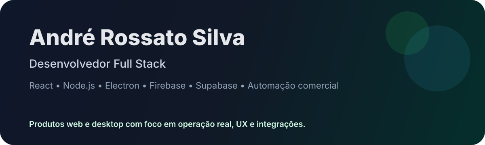

# Olá, eu sou André Rossato Silva

Sou desenvolvedor full stack e construo produtos web e desktop com foco em automação comercial, operação de negócios e experiências digitais bem acabadas.

Meu trabalho combina frontend responsivo, backend, banco de dados, autenticação, integrações externas, deploy e empacotamento desktop. Gosto de tirar ideias do papel e levar até uma versão utilizável, com interface clara e estrutura pronta para evoluir.

## Stack que uso

## Projetos em destaque

| Projeto | O que faz | Stack |
| --- | --- | --- |
| [GameMatch](https://github.com/gustech020-prog/GameMatch) | Descoberta de jogos por swipe, favoritos, salas em grupo e matches compartilhados. Demo: [gamematch-one.vercel.app](https://gamematch-one.vercel.app) | React, Vite, Firebase, RAWG API, Vercel |
| [Gustech](https://github.com/gustech020-prog/Gustech) | Storefront/e-commerce gamer com catálogo, carrinho, pedidos, favoritos e backend próprio. | JavaScript, Node.js, Express, SQLite/MySQL, Firebase |
| ServeAI | Sistema para restaurantes com PDV, cardápio online, pedidos, caixa, relatórios, WhatsApp e robô de atendimento. | React, TypeScript, Electron, Supabase, Evolution API |
| AutoWap | Aplicativo desktop para atendimento, campanhas, CRM leve e integração com WhatsApp/Evolution API. | Electron, React, TypeScript, Mantine, Prisma, SQLite/PGlite |

## O que eu entrego bem

- Interfaces responsivas em React com estados claros e boa experiência de uso.
- Backends em Node.js/Express com validação, persistência e APIs REST.
- Integrações com Firebase, Supabase, WhatsApp/Evolution API e APIs externas.
- Aplicações desktop com Electron e instaladores para Windows.
- Deploy, organização de repositórios, testes e documentação de projeto.

## Métricas públicas

  
  

## Links

- GitHub: [github.com/gustech020-prog](https://github.com/gustech020-prog)
- Demo principal: [GameMatch](https://gamematch-one.vercel.app)

Aberto a oportunidades e colaborações em desenvolvimento full stack, produtos SaaS, automação comercial e apps web/desktop.